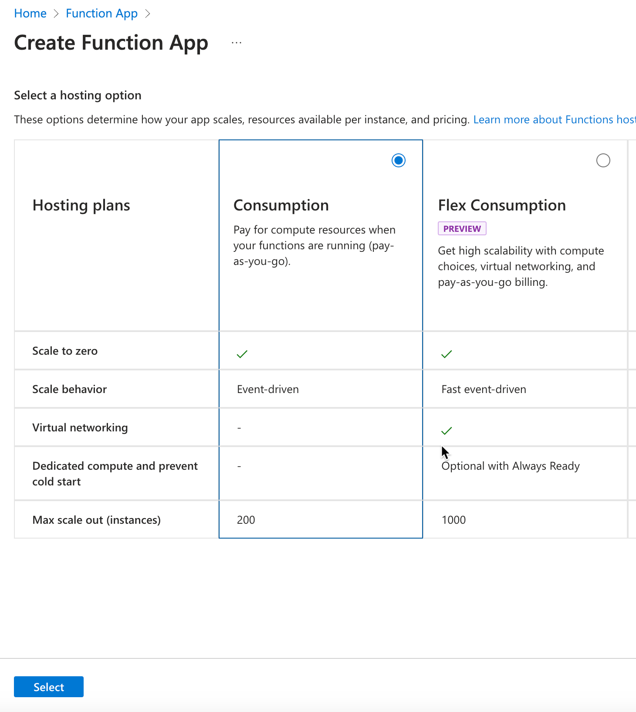
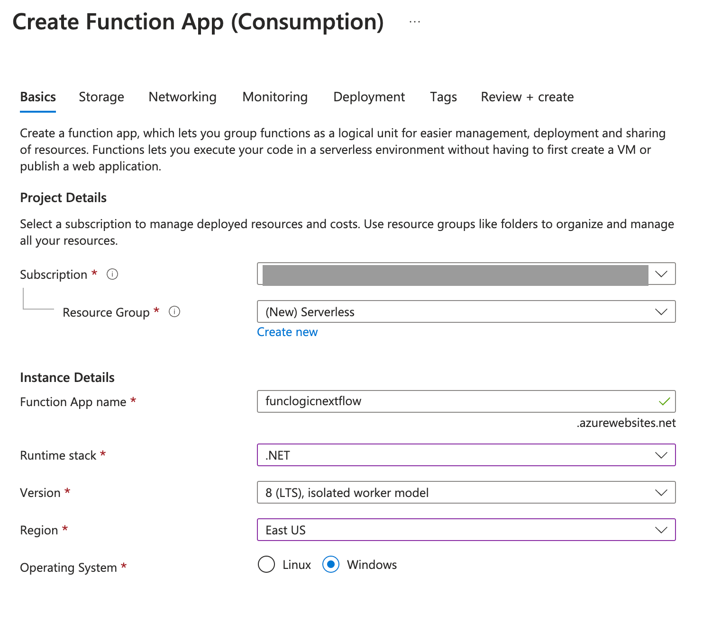
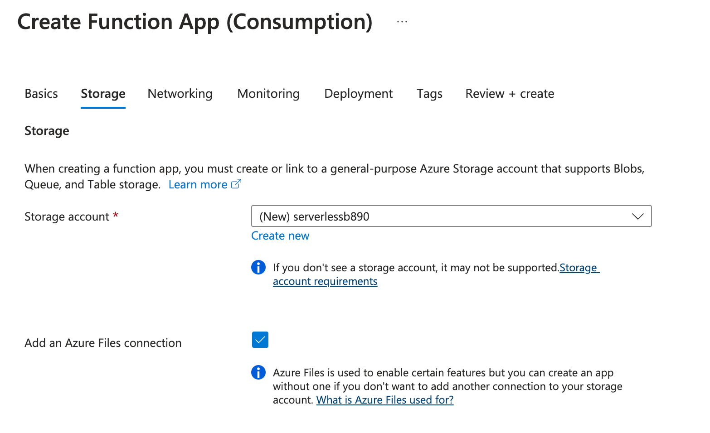
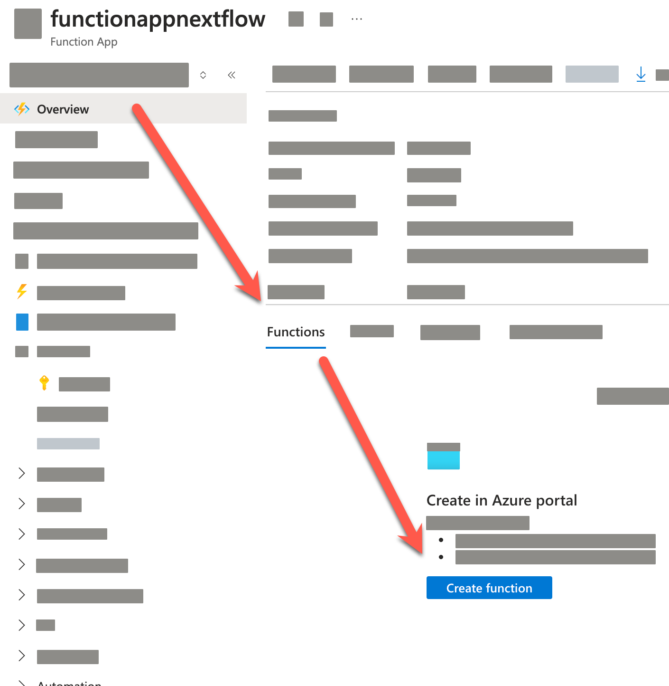

# Lab 02: Azure Functions

## Microsoft Azure user interface

Given the dynamic nature of Microsoft cloud tools, you might experience Azure UI changes that occur after the development of this training content. As a result, the lab instructions and lab steps might not align correctly.

Microsoft updates this training course when the community alerts us to needed changes. However, cloud updates occur frequently, so you might encounter UI changes before this training content updates. **If this occurs, adapt to the changes, and then work through them in the labs as needed.**

## Instructions

### Before you start

#### Sign in to the lab environment

Sign in to your Azure portal using the credentials provided.

> **Note**: Your lab host will provide instructions to connect to the virtual lab environment.

## Lab Scenario

In this lab, you will demonstrate the ability to create a simple Azure function that echoes text that is entered and sent to the function by using HTTP POST commands. This will illustrate how the function can be triggered over HTTP. 

### Exercise 1: Create Azure resources

#### Task 1: Open the Azure portal

1. On the taskbar, select the **Microsoft Edge** icon.
1. In the browser window, browse to the Azure portal at `https://portal.azure.com`, and then sign in with the account you'll be using for this lab.

    > **Note**: If this is your first time signing in to the Azure portal, you'll be offered a tour of the portal. If you prefer to skip the tour, select **Get Started** to begin using the portal.

#### Task 2: Create an Azure Storage account

> If you have limited time on labs, your can pass this task and use the storage account that is created automatically when you create the function app in task 3.

1. In the Azure portal, use the **Search resources, services, and docs** text box to search for **Storage Accounts**, and then, in the list of results, select **Storage Accounts**.

1. On the **Storage accounts** blade, select **+ Create**.

1. On the **Create a storage account** blade, on the **Basics** tab, perform the following actions, and then select **Review**:

    | Setting | Action |
    | -- | -- |
    | **Subscription** drop-down list | Retain the default value |
    | **Resource group** section | Select **Create new**, enter _[yourname]_**Serverless**, and then select **OK** |
    | **Storage account name** text box | Enter **funcstor**_[yourname]_ |
    | **Region** drop-down list | Select **(US) East US** |
    | **Performance** section | Select the **Standard** option |
    | **Redundancy** drop-down list | Select **Locally-redundant storage (LRS)** |

    The following screenshot displays the configured settings in the **Create a storage account** blade.

    

1. On the **Review** tab, review the options that you selected during the previous steps.

1. Select **Create** to create the storage account by using your specified configuration.

    > **Note**: Wait for the creation task to complete before you proceed with this lab.

1. On the **Overview** blade, select the **Go to resource** button to navigate to the blade of the newly created storage account.

1. On the **Storage account** blade, in the **Security + networking** section, select **Access keys**.

1. On the **Access keys** blade, select **Show keys**.

1. On the **Access keys** blade, review any one of the **Connection string**\s (using **Show** button), and then record the value of either **Connection string** boxes in Notepad. The **Key**\s are platform managed encryption keys and are **not** used for this lab.

   > **Note**: It doesn't matter which connection string you choose. They are interchangeable.

1. Open Notepad, and then paste the copied connection string value to Notepad. You'll use this value later in this lab.

#### Task 3: Create a function app

1. On the Azure portal's navigation pane, select the **Create a resource** link.

1. On the **Create a resource** blade, in the **Search services and marketplace** text box, enter **Function**, and then select Enter.

1. On the **Marketplace** search results blade, select the **Function App** result.

1. On the **Function App** blade, select **Create**.

1. On the **Create Function App** blade, ensure **Consumption** is the selected hosting plan, and then click **Select**.

2. On the **Create Function App (Consumption)** blade, on the **Basics** tab, perform the following actions, and then select **Next: Storage**:

    | Setting | Action |
    | -- | -- |
    | **Subscription** drop-down list | Retain the default value |
    | **Resource group** section | Select **create new** and name it: _[yourname]_**Serverless** |
    | **Function App name** text box | Enter **funclogic**_[yourname]_ |
    | **Runtime stack** drop-down list | Select **NodeJS** |
    | **Version** drop-down list | Select **20 (LTS)** |
    | **Region** drop-down list | Select the **East US** region |
    | **Operating System** option | Select **Windows** |

    > in-portal editing only support on Windows
    
    The following screenshot displays the configured settings in the **Create Function App** blade.

    

    

3. On the **Storage** tab, perform the following actions, and then select **Review + create**:

    | Setting | Action |
    | -- | -- |
    | **Storage account** drop-down list | check the new storage account name that will create for your function app |

    

4. On the **Review + create** tab, review the options that you selected during the previous steps.

5. Select **Create** to create the function app by using your specified configuration.

    > **Note**: Wait for the creation task to complete before you move forward with this lab.

6. After the deployment completed, Select **Go to resource** to view your new function app. 

#### Review

In this exercise, you created all the resources that you'll use in this lab.

### Exercise 2: Create an HTTP trigger function

#### Task 1: Create the function on portal

> Note: You have to ensure the function app resource is created completely (check from )

1. In your function app, select **Overview**, and then select **Create Function** under **Functions** tab.
   
2. Under **Select a template**, scroll down and choose the **HTTP trigger template**.
3. Select **Next**.
4. In Template details, set Function name to **HttpExample** for New Function
5. Select **Anonymous** from the **Authorization level** drop-down list.
6. Select **Create**.

#### Task 2: Test the function

1. Under the **Code + Test** tab, select **Test/Run**
2. In the **Input** tab, perform following action: 
    | Setting | Action |
    | -- | -- |
    | **HTTP Method** drop-down list | POST |
    | **Key** drop-down list | _master (Host Key) |
    Leave the **Request body** as default.

3. Select **Run** to test the function.
4. Explore value from **Output** tab
5. Explore the **Logs** tab to see the log output.
6. Explore the **Function Keys** tab to see the function key.
7. Explore the **Metrics** tab to see the function metrics. (It might take a few minutes to show the metrics)

### Remove the resources group

1. In the Azure portal, use the **Search resources, services, and docs** text box to search for **Resource groups**, and then in the list of results, select _[yourname]_**Serverless**.
2. On the _[yourname]_**Serverless** blade, select **Delete resource group**.
3. In the **Delete resource group** blade, enter the name of the resource group to confirm that you want to delete the resource group, and then select **Delete**.

## Review

In this exercise, you deployed a local function project to Azure Functions and validated that the functions work in Azure.
