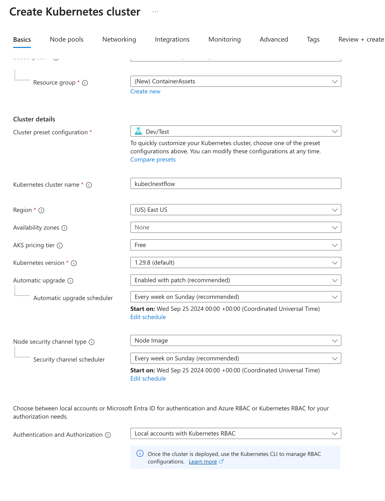
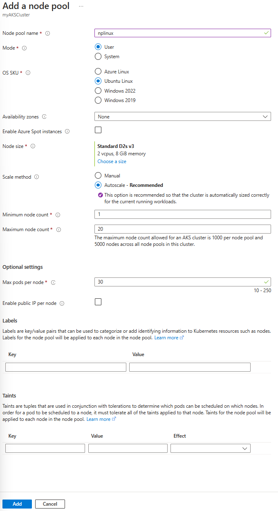
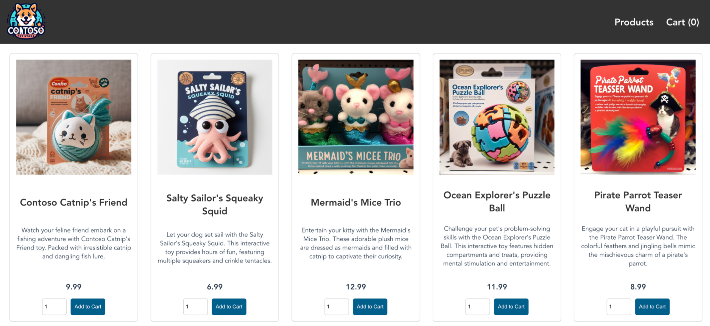

# Lab 3: Create and deploy application on Azure Kubernetes Service

## Microsoft Azure user interface

Given the dynamic nature of Microsoft cloud tools, you might experience Azure UI changes that occur after the development of this training content. As a result, the lab instructions and lab steps might not align correctly.

Microsoft updates this training course when the community alerts us to needed changes. However, cloud updates occur frequently, so you might encounter UI changes before this training content updates. **If this occurs, adapt to the changes, and then work through them in the labs as needed.**

## Instructions

### Before you start

#### Sign in to the lab environment

Sign in to your Azure portal using the credentials provided.

> **Note**: Your lab host will provide instructions to connect to the virtual lab environment.


## Lab Scenario

In this lab, you will create an Azure Kubernetes Service (AKS) cluster and deploy a containerized application to it. 


### Exercise 1: Create and configure Azure resources

#### Task 1: Open the Azure portal

1. On the taskbar, select the **Microsoft Edge** icon.

1. In the browser window, browse to the Azure portal at `https://portal.azure.com`, and then sign in with the account you'll be using for this lab.

    > **Note**: If this is your first time signing in to the Azure portal, you'll be offered a tour of the portal. Select **Get Started** to skip the tour and begin using the portal.

#### Task 2: Create an Azure Kubernetes Cluster resource

1. In the Azure portal, use the **Search resources, services, and docs** text box at the top of the page to search for **Azure Kubenetes Service (AKS)** and then, in the list of results, select **Azure Kubenetes Service (AKS)**.

1. On the **Azure Kubenetes Service (AKS)** blade, select **+ Create**.

1. On the **Azure Kubenetes Service (AKS)** blade, on the **Basics** tab, perform the following actions, and select **Next**:
    
    | Setting | Action |
    | -- | -- |
    | **Subscription** drop-down list | Retain the default value |
    | **Resource group** section | Select **Create new**, enter _[yourname]_**ContainerAssets**, and then select **OK** **(Noted this for later)**|
    | **Cluster preset configuration** drop-down list | Select **Dev/Test** |
    | **Name** text box | **kubecl**_[yourname]_ **(Noted this for later)**|
    | **Region** drop-down list | Select any Azure region in which you can deploy an Application Insights resource |
    | **Availability Zone** section | Select **None** |
    | **AKS pricing tier** section | Select **Free** |
    | **Leave the default values for the remaining settings** |  |
    
    The following screenshot displays the configured settings on the **Application Insights** blade.

    
     
2. On the** Node pools** tab, select **Add node pool** configure the following settings:

    |Setting|Value|
    |--|--|
    |**Node pool name** text box|Enter a name, such as **nplinux**|
    |**Mode** drop-down list|Select **User**|
    |**OS SKU** drop-down list|Select **Ubuntu Linux**|
    |**Availability zones** section|Select **None**|
    |**Enable Azure Spot instances** checkbox|Leave unchecked|
    |**Node size** section|Select **Choose a size**. On the **Select a VM size** page, select **D2s_v3**, then select **Select**|
    |**Leave the default values for the remaining settings**||

    


5. Select **Review + create** to run validation on the cluster configuration. After validation completes, select **Create**.

### Exercise 2: Connect to the cluster

1. On the taskbar, select the **Microsoft Edge** icon.

2. In the browser window, browse to the Azure portal at `https://portal.azure.com`, and then sign in with the account you'll be using for this lab.

    > **Note**: If this is your first time signing in to the Azure portal, you'll be offered a tour of the portal. Select **Get Started** to skip the tour and begin using the portal.

3. In the Azure portal, select the **Cloud Shell** icon  to open a the Cloud Shell. If Cloud Shell defaults to a PowerShell session, select **Switch to Bash** in the **Cloud Shell** menu and then select **Confirm**.

    > **Note**: The **Cloud Shell** icon is represented by a greater than sign (\>) and underscore character (\_).

    If this is the first time you're starting **Cloud Shell** you will be presented with a series of prompts to create the resource. Perform the actions presented in the following table:

    | Prompt | Action |
    |--|--|
    | Welcome to Azure Cloud Shell | Select **Bash**. |
    | Getting Started | Select **Mount storage account**, then select your **Storage account subscription** from the drop-down, and finally select **Apply**. |
    | Mount storage account | Select **We will create a storage account for you**, and then select **Next**. |


4. After the Cloud Shell is ready, run the following command to configure kubectl to connect to your Kubernetes cluster. This command downloads credentials and configures the Kubernetes CLI to use them:

    ```bash
    az aks get-credentials --resource-group <your-resource-group-name> --name <your-cluster-name>
    ```

    > **Note**: Replace `<your-resource-group-name>` with the name of the resource group you created earlier and `<your-cluster-name>` with the name of the AKS cluster you created earlier.

    > **Note**: if it's failed. Try to run `az login` to ensure you are logged in to the correct subscription.

5. Verify the connection to your cluster using kubectl get to return a list of the cluster nodes.
    
    ```bash
    kubectl get nodes
    ```

    > **Note**: The output should list the nodes in your cluster.

    The following example output shows the single node created in the previous steps. Make sure the node status is Ready.

    ```bash
    NAME                                STATUS   ROLES   AGE       VERSION
    aks-nodepool1-31718369-0   Ready    agent    6m44s   v1.15.10
    ```

### Exercise 3: Deploy the application

1. You use a manifest file to create all the objects required to run the [AKS Store application](https://github.com/Azure-Samples/aks-store-demo). A Kubernetes manifest file defines a cluster's desired state, such as which container images to run. The manifest includes the following Kubernetes deployments and services:


- Store front: Web application for customers to view products and place orders.
- Product service: Shows product information.
- Order service: Places orders.
- Rabbit MQ: Message queue for an order queue.

> **Note**: We don't recommend running stateful containers, such as Rabbit MQ, without persistent storage for production. These are used here for simplicity, but we recommend using managed services, such as Azure CosmosDB or Azure Service Bus.

1. On the Azure Cloud Shell, run the following command to create a file named **aks-store-quickstart.yaml**:

    ```bash
    touch aks-store-quickstart.yaml
    ```
    
2. Run the following command to open the file in the code editor:

    ```bash
    code aks-store-quickstart.yaml
    ```

    > **Note**: if you are prompted about switching to the classic editor, select **Yes**. then run the command again.

3. Copy the following YAML code and paste it into the **aks-store-quickstart.yaml** file:

    ```yaml
    apiVersion: apps/v1
    kind: Deployment
    metadata:
    name: rabbitmq
    spec:
    replicas: 1
    selector:
        matchLabels:
        app: rabbitmq
    template:
        metadata:
        labels:
            app: rabbitmq
        spec:
        nodeSelector:
            "kubernetes.io/os": linux
        containers:
        - name: rabbitmq
            image: mcr.microsoft.com/mirror/docker/library/rabbitmq:3.10-management-alpine
            ports:
            - containerPort: 5672
            name: rabbitmq-amqp
            - containerPort: 15672
            name: rabbitmq-http
            env:
            - name: RABBITMQ_DEFAULT_USER
            value: "username"
            - name: RABBITMQ_DEFAULT_PASS
            value: "password"
            resources:
            requests:
                cpu: 10m
                memory: 128Mi
            limits:
                cpu: 250m
                memory: 256Mi
            volumeMounts:
            - name: rabbitmq-enabled-plugins
            mountPath: /etc/rabbitmq/enabled_plugins
            subPath: enabled_plugins
        volumes:
        - name: rabbitmq-enabled-plugins
            configMap:
            name: rabbitmq-enabled-plugins
            items:
            - key: rabbitmq_enabled_plugins
                path: enabled_plugins
    ---
    apiVersion: v1
    data:
    rabbitmq_enabled_plugins: |
        [rabbitmq_management,rabbitmq_prometheus,rabbitmq_amqp1_0].
    kind: ConfigMap
    metadata:
    name: rabbitmq-enabled-plugins
    ---
    apiVersion: v1
    kind: Service
    metadata:
    name: rabbitmq
    spec:
    selector:
        app: rabbitmq
    ports:
        - name: rabbitmq-amqp
        port: 5672
        targetPort: 5672
        - name: rabbitmq-http
        port: 15672
        targetPort: 15672
    type: ClusterIP
    ---
    apiVersion: apps/v1
    kind: Deployment
    metadata:
    name: order-service
    spec:
    replicas: 1
    selector:
        matchLabels:
        app: order-service
    template:
        metadata:
        labels:
            app: order-service
        spec:
        nodeSelector:
            "kubernetes.io/os": linux
        containers:
        - name: order-service
            image: ghcr.io/azure-samples/aks-store-demo/order-service:latest
            ports:
            - containerPort: 3000
            env:
            - name: ORDER_QUEUE_HOSTNAME
            value: "rabbitmq"
            - name: ORDER_QUEUE_PORT
            value: "5672"
            - name: ORDER_QUEUE_USERNAME
            value: "username"
            - name: ORDER_QUEUE_PASSWORD
            value: "password"
            - name: ORDER_QUEUE_NAME
            value: "orders"
            - name: FASTIFY_ADDRESS
            value: "0.0.0.0"
            resources:
            requests:
                cpu: 1m
                memory: 50Mi
            limits:
                cpu: 75m
                memory: 128Mi
        initContainers:
        - name: wait-for-rabbitmq
            image: busybox
            command: ['sh', '-c', 'until nc -zv rabbitmq 5672; do echo waiting for rabbitmq; sleep 2; done;']
            resources:
            requests:
                cpu: 1m
                memory: 50Mi
            limits:
                cpu: 75m
                memory: 128Mi
    ---
    apiVersion: v1
    kind: Service
    metadata:
    name: order-service
    spec:
    type: ClusterIP
    ports:
    - name: http
        port: 3000
        targetPort: 3000
    selector:
        app: order-service
    ---
    apiVersion: apps/v1
    kind: Deployment
    metadata:
    name: product-service
    spec:
    replicas: 1
    selector:
        matchLabels:
        app: product-service
    template:
        metadata:
        labels:
            app: product-service
        spec:
        nodeSelector:
            "kubernetes.io/os": linux
        containers:
        - name: product-service
            image: ghcr.io/azure-samples/aks-store-demo/product-service:latest
            ports:
            - containerPort: 3002
            resources:
            requests:
                cpu: 1m
                memory: 1Mi
            limits:
                cpu: 1m
                memory: 7Mi
    ---
    apiVersion: v1
    kind: Service
    metadata:
    name: product-service
    spec:
    type: ClusterIP
    ports:
    - name: http
        port: 3002
        targetPort: 3002
    selector:
        app: product-service
    ---
    apiVersion: apps/v1
    kind: Deployment
    metadata:
    name: store-front
    spec:
    replicas: 1
    selector:
        matchLabels:
        app: store-front
    template:
        metadata:
        labels:
            app: store-front
        spec:
        nodeSelector:
            "kubernetes.io/os": linux
        containers:
        - name: store-front
            image: ghcr.io/azure-samples/aks-store-demo/store-front:latest
            ports:
            - containerPort: 8080
            name: store-front
            env:
            - name: VUE_APP_ORDER_SERVICE_URL
            value: "http://order-service:3000/"
            - name: VUE_APP_PRODUCT_SERVICE_URL
            value: "http://product-service:3002/"
            resources:
            requests:
                cpu: 1m
                memory: 200Mi
            limits:
                cpu: 1000m
                memory: 512Mi
    ---
    apiVersion: v1
    kind: Service
    metadata:
    name: store-front
    spec:
    ports:
    - port: 80
        targetPort: 8080
    selector:
        app: store-front
    type: LoadBalancer
    ```

4. Save the file and close the code editor.
5. Deploy the application using the kubectl apply command and specify the name of your YAML manifest:

    ```bash
    kubectl apply -f aks-store-quickstart.yaml
    ```

    The following example output shows the deployments and services:

    ```bash
    deployment.apps/rabbitmq created
    service/rabbitmq created
    deployment.apps/order-service created
    service/order-service created
    deployment.apps/product-service created
    service/product-service created
    deployment.apps/store-front created
    service/store-front created
    ```

### Exercise 4: Test the application

When the application runs, a Kubernetes service exposes the application front end to the internet. This process can take a few minutes to complete.

1. Check the status of the deployed pods using the `kubectl get pods` command. Make sure all pods are Running before proceeding.

    ```bash
    kubectl get pods
    ```


2. Check for a public IP address for the store-front application. Monitor progress using the `kubectl get service` command with the `--watch` argument.

    ```bash
    kubectl get service store-front --watch
    ```
    
    The EXTERNAL-IP output for the store-front service initially shows as pending:

    ```bash
    NAME          TYPE           CLUSTER-IP    EXTERNAL-IP   PORT(S)        AGE
    store-front   LoadBalancer   10.0.100.10   <pending>     80:30025/TCP   4h4m
    ```

3. Once the EXTERNAL-IP address changes from pending to an actual public IP address, use **CTRL-C** to stop the kubectl watch process.
   
    ```bash
    NAME          TYPE           CLUSTER-IP    EXTERNAL-IP    PORT(S)        AGE
    store-front   LoadBalancer   10.0.100.10   20.62.159.19   80:30025/TCP   4h5m
    ```
   
4. Open a web browser to the **external IP address** of your service to see the Azure Store app in action. For example, this case is `20.62.159.19`.



### Remove the resources group

1. In the Azure portal, use the **Search resources, services, and docs** text box to search for **Resource groups**, and then in the list of results, select _[yourname]_**ContainerAssets**.
2. On the _[yourname]_**ContainerAssets** blade, select **Delete resource group**.
3. In the **Delete resource group** blade, enter the name of the resource group to confirm that you want to delete the resource group, and then select **Delete**.


## Review

In this exercise, you configured and tested Application which are deployed to an Azure Kubernetes Service (AKS) cluster.