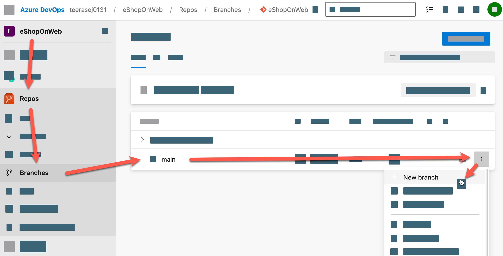
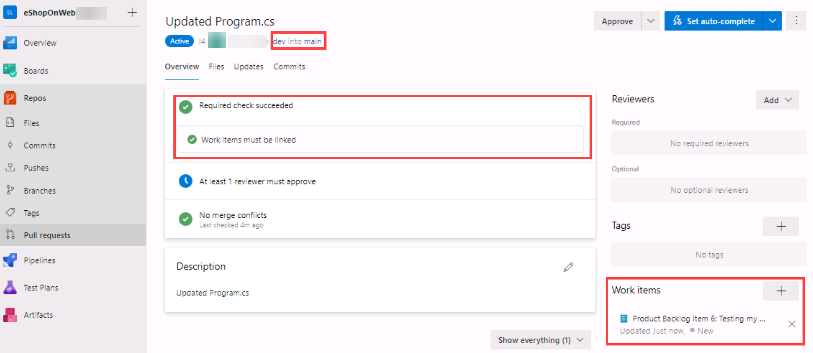

# Lab 06-1: Code Review

## Microsoft Azure DevOps user interface

Given the dynamic nature of Microsoft cloud tools, you might experience Azure DevOps UI changes that occur after the development of this training content. As a result, the lab instructions and lab steps might not align correctly.

Microsoft updates this training course when the community alerts us to needed changes. However, cloud updates occur frequently, so you might encounter UI changes before this training content updates. **If this occurs, adapt to the changes, and then work through them in the labs as needed.**

## Instructions

### Before you start


### Exercise 1: Create the sample Azure DevOps Project

> **Note**: make sure you already have your Azure DevOps Organization before continuing with these steps.

In this exercise, you will set up the prerequisites for the lab, which consist of a new Azure DevOps project with a repository based on the [eShopOnWeb](https://github.com/MicrosoftLearning/eShopOnWeb).

#### Task 1:  Create and configure the team project

In this task, you will create an **eShopOnWeb** Azure DevOps project to be used by several labs.

#### Task 2:  Import eShopOnWeb Git Repository

In this task you will import the eShopOnWeb Git repository that will be used by several labs.

1. On your lab computer, in a browser window open your Azure DevOps organization and the previously created **eShopOnWeb** project. Click on **Repos>Files** , **Import a Repository**. Select **Import**. On the **Import a Git Repository** window, paste the following URL <https://github.com/MicrosoftLearning/eShopOnWeb.git>  and click **Import**:

    

1. The repository is organized the following way:
    - **.ado** folder contains Azure DevOps YAML pipelines.
    - **.devcontainer** folder container setup to develop using containers (either locally in VS Code or GitHub Codespaces).
    - **infra** folder contains Bicep&ARM infrastructure as code templates used in some lab scenarios.
    - **.github** folder container YAML GitHub workflow definitions.
    - **src** folder contains the .NET 8 website used on the lab scenarios.

You have now completed the necessary prerequisite steps to continue with the different individual labs.


### Exercise 2: Working with branches

#### Task 1: Create a new branch

1. Switch to the the web browser displaying your Azure DevOps organization with the **eShopOnWeb** project you generated in the previous exercise.

2. In the vertical navigational pane of the Azure DevOps portal, select the **Repos** icon.

3. In the **Repos** blade, select the **Branches** tab.

4. Click on option button on the right of **main** branch and select **New branch**.

    

5. In the **Create a branch** dialog, enter the name **dev** and click **Create**.

#### Task 2: Setting Branch Policies

1. Switch to the web browser displaying the **Mine** tab of the **Branches** pane in the Azure DevOps portal.
2. On the **Mine** tab of the **Branches** pane, hover the mouse pointer over the **main** branch entry to reveal the ellipsis symbol on the right side.
3. Click the ellipsis and, in the pop-up menu, select **Branch Policies**.

    

1. On the **main** tab of the repository settings, enable the option for **Require minimum number of reviewers**. Add **1** reviewer and check the box **Allow requestors to approve their own changes**(as you are the only user in your project for the lab)
1. On the **main** tab of the repository settings, enable the option for **Check for linked work items** and leave it with **Required** option.

    


#### Task 3: Testing Branch Policies

1. In the vertical navigational pane of the of the Azure DevOps portal, in the **Repos>Files**, make sure the **main** branch is selected (dropdown above shown content).
2. To make sure policies are working, try making a change and committing it on the **main** branch, navigate to the **/eShopOnWeb/src/Web/Program.cs** file and select it. This will automatically display its content in the details pane.
3. On the first line add the following comment:

    ```csharp
    // Testing main branch policy
    ```

4. Click on **Commit > Commit**. You will see a warning: changes to the main branch can only be done using a Pull Request.

    

5. Click on **Cancel** to skip the commit.

#### Task 4: Working with Pull Requests

In this task, you will use the Azure DevOps portal to create a Pull Request, using the **dev** branch to merge a change into the protected **main** branch. An Azure DevOps work item will be linked to the changes to be able to trace pending work with code activity.

1. In the vertical navigational pane of the of the Azure DevOps portal, in the **Boards** section, select **Work Items**.
1. Click on **+ New Work Item > Product Backlog Item**. In title field, write **Testing my first PR** and click on **Save**.
1. Now go back to the vertical navigational pane of the of the Azure DevOps portal, in the **Repos>Files**, make sure the **dev** branch is selected.
2. Navigate to the **/eShopOnWeb/src/Web/Program.cs** file and make the following change on the first line:

    ```csharp
    // Testing my first PR
    ```

3. Click on **Commit > Commit** (leave default commit message). This time the commit works, **dev** branch has no policies.
4. A message will pop-up, proposing to create a Pull Request (as you **dev** branch is now ahead in changes, compared to **main**). Click on **Create a Pull Request**.

    

5. In the **New pull request** tab, leave defaults and click on **Create**.
6. The Pull Request will show some failed/pending requirements, based on the policies applied to our target **main** branch.
    - At least 1 user should review and approve the changes.
    - Proposed changes should have a work item linked
1. On the right side options, click on the **+** button next to **Work Items**. Link the previously created work item to the Pull Request by clicking on it. You will see one of the requirements changes  status.

    
7. Next,  open the **Files** tab to review the proposed changes. In a more complete Pull Request,  you would be able to review files one by one (marked as reviewed) and open comments for lines that may not be clear (hovering the mouse over the line number gives you an option to post a comment).
8. Go back to the **Overview** tab, and on the top-right click on **Approve**. All the requirements will change to green. Now you can click on **Complete**.
9.  On the **Complete Pull Request** tab, multiple options will be given before completing the merge:
    - **Merge Type**: Choose **Merge (no fast forward)**.

10. Click on **Complete Merge**

#### Review

In this exercise, you created a new branch, set branch policies, and created a Pull Request to merge changes into the main branch. You also linked a work item to the Pull Request to track the changes.
